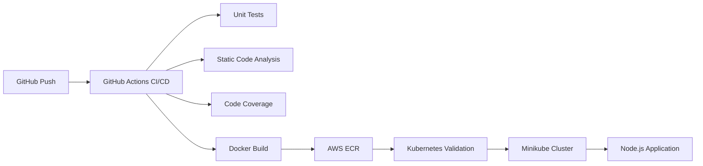

# Demo DevOps Node.js - Mariano Andrigo

Proyecto realizado como solución para la prueba técnica DevOps.

## Tecnologías utilizadas

- Node.js
- Docker
- Kubernetes
- Minikube
- GitHub Actions
- Terraform
- AWS ECR

---

# Arquitectura



---

# Pipeline CI/CD

El pipeline implementado con GitHub Actions incluye:

- Code Build
- Unit Tests
- Static Code Analysis (ESLint)
- Code Coverage
- Docker Build
- Docker Push hacia AWS ECR

Archivo del pipeline:

```bash
.github/workflows/pipeline.yml
```

---

# Infraestructura como Código

Se utilizó Terraform para crear el repositorio ECR en AWS.

Ubicación:

```bash
terraform/ecr
```

Comando utilizado:

```bash
terraform init
terraform apply
```

---

# Docker

## Build local

```bash
docker build -t demo-devops-nodejs:local .
```

## Run local

```bash
docker run -p 8000:8000 demo-devops-nodejs:local
```

---

# Kubernetes

Se creó el despliegue utilizando Minikube y Kubernetes.

Recursos implementados:

- Namespace
- Deployment
- Service
- ConfigMap
- Secret
- Horizontal Pod Autoscaler

Ubicación:

```bash
k8s/
```

## Aplicar manifiestos

```bash
kubectl apply -f k8s/
```

## Ver recursos

```bash
kubectl get all -n demo-devops
```

---

# Validación local

## Crear usuario

```bash
curl.exe -X POST http://localhost:8000/api/users `
-H "Content-Type: application/json" `
-d '{\"dni\":\"37376236\",\"name\":\"Mariano-Andrigo\"}'
```

## Obtener usuarios

```bash
curl.exe http://localhost:8000/api/users
```

---

# Despliegue Kubernetes

El despliegue fue validado localmente utilizando Minikube.

Por tratarse de un entorno local, no se expone una URL pública.

La validación se realizó mediante:

- kubectl
- curl
- probes de Kubernetes
- verificación de pods y servicios

---

# AWS ECR

La imagen Docker es publicada automáticamente hacia AWS ECR mediante GitHub Actions.

Repositorio ECR:

```bash
460210064623.dkr.ecr.us-east-1.amazonaws.com/demo-devops-nodejs
```

---

# Consideraciones

- Se utilizó SQLite como base de datos local.
- Se agregaron healthchecks en Docker y Kubernetes.
- Se implementaron readiness y liveness probes.
- Se utilizaron buenas prácticas de contenedorización:
  - usuario no root
  - variables de entorno
  - separación de responsabilidades
  - ignore de archivos sensibles y temporales

---

# Repositorio

GitHub:

```bash
https://github.com/marianoandrigo93/demo-devops-nodejs-mariano
```